# Documentation

You need to clone our repository and run the app using

```
./gradlew run
```

## How to use

Firstly, you need to choose a graph

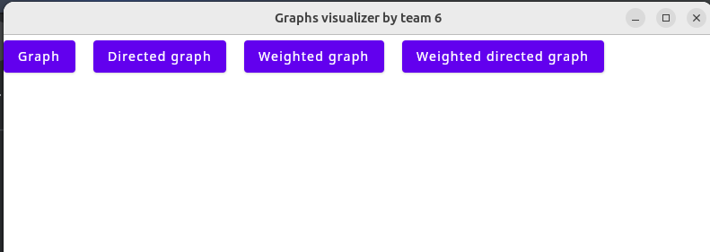

## Undirected unweighted graph

Here is the example of our graph window

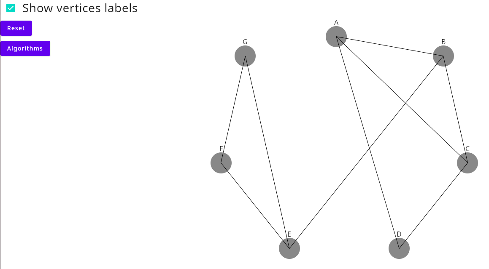

If you click "Reset", graph will become as it was before you started manipulating it.

If you click "Algorithms", you will be suggested to use algorithms of this graph

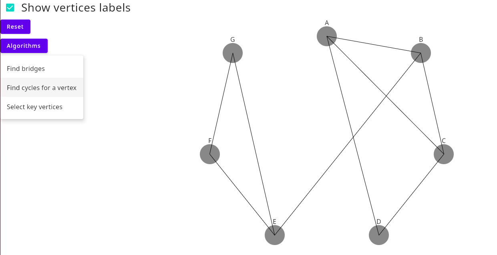

### Bridges

Bridge edges are highlighted with red color.

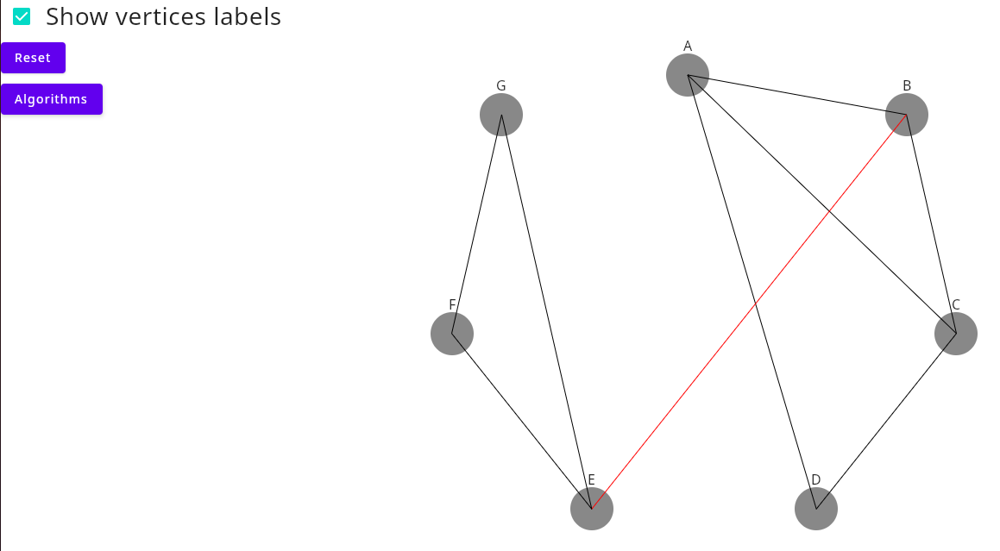

### Cycles search for given vertex

You are suggested to put in a number of chosen vertex

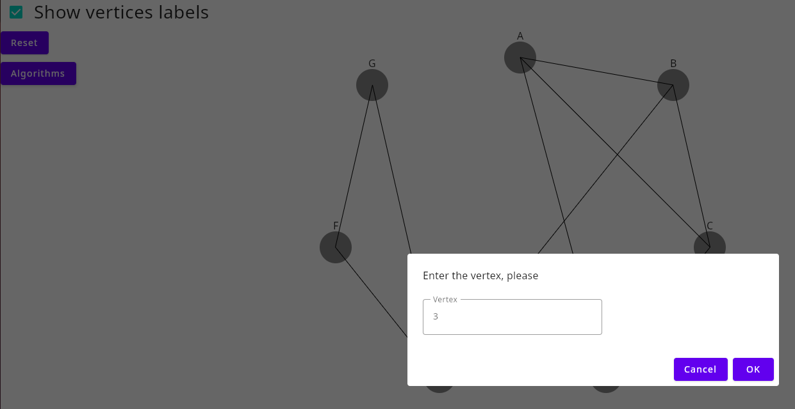

Then you receive highlighted cycle of this vertex, or vertex becomes highlighted with blue color if it doesn't belong to any cycle

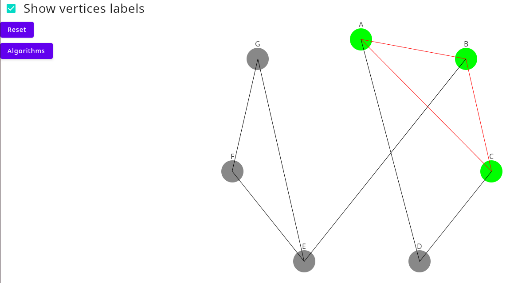

### Key vertices selection

You receive highlighted key vertices of this graph

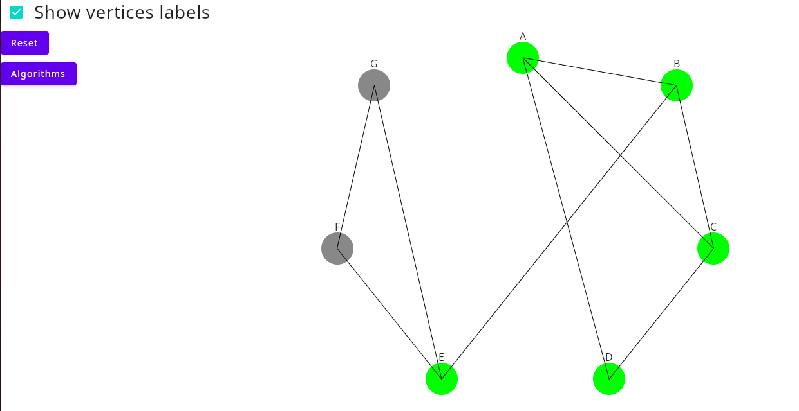

## Directed unweighted graph

Directed graph has some undirected graph algorithms, but also there is selection of strongly connected components.

### Strongly connected components selection

Each component is highlighted with its unique color.

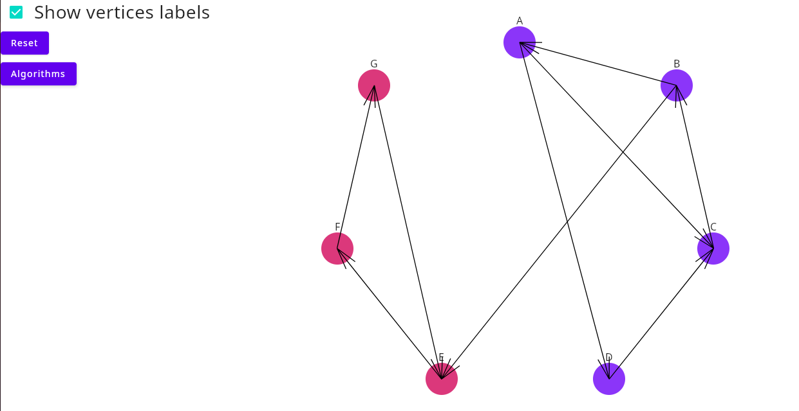

## Undirected weighted graph

In weighted graph, you can see weights of edges

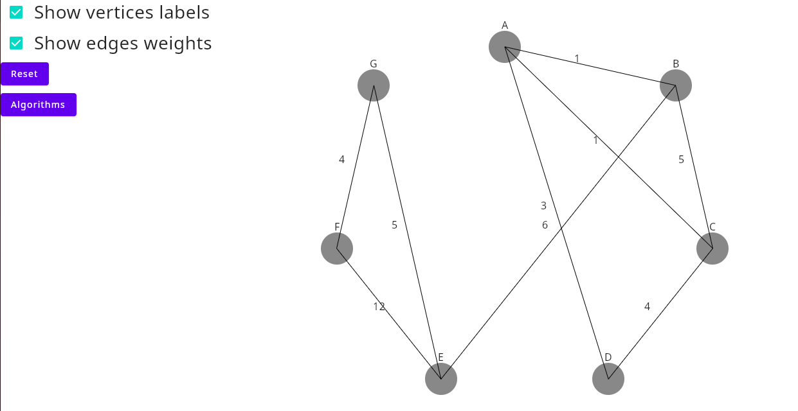

### Minimal spanning tree construction

Included edges are highlighted with red

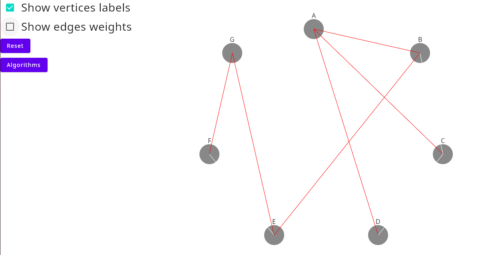

### Path finding

To find a path, you need to pick source and destination vertices

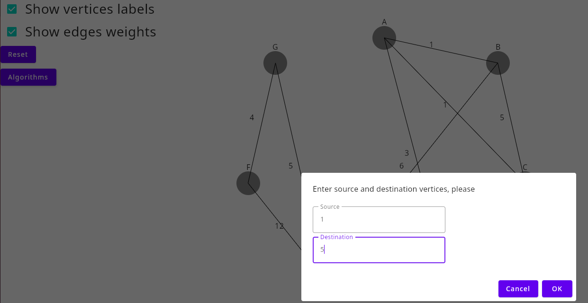

Path is highlighted. Notice that we don't support negative weights for path finding in undirected graph.

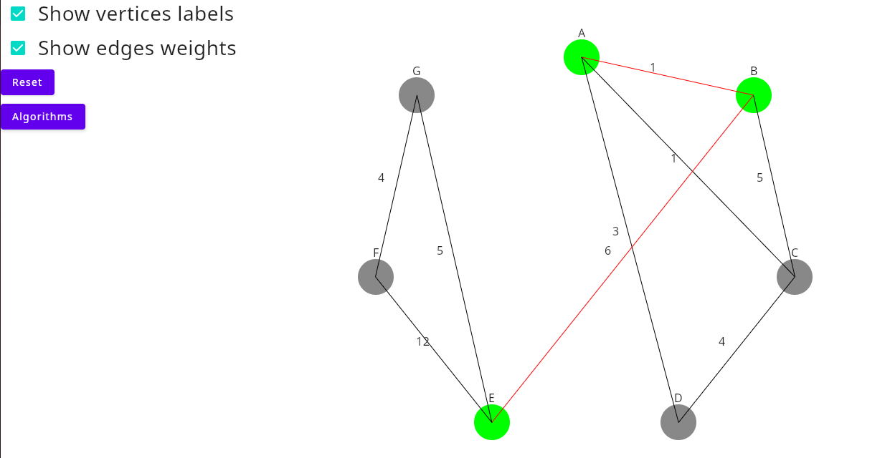

## Weighted directed graph
All its algorithms are already explained above